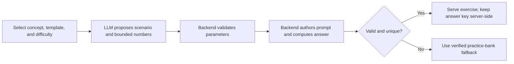
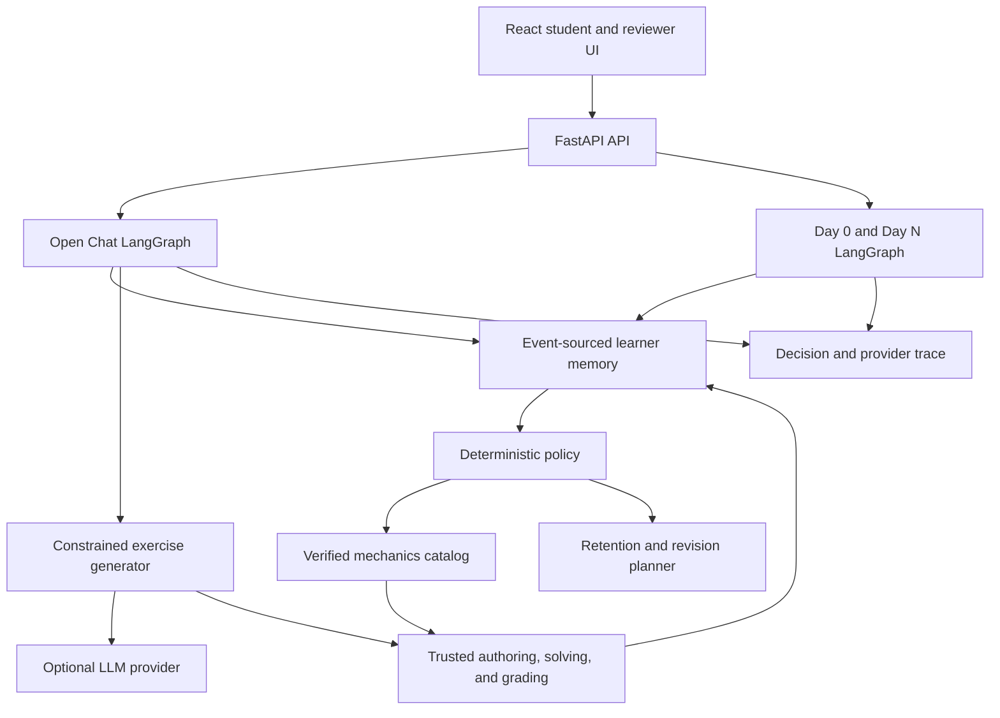

# Olympiz Adaptive Tutor: latest work-trial features

- **Updated:** 9 September 2026
- **Branch:** `feat/dayn-revision-plan`
- **Audience:** Work trial reviewers, product partners, and engineers

## Executive overview

The prototype now supports a continuous learning journey around one teacher-authored class lesson:

1. **Day 0** establishes an initial learner state through a cold-start diagnostic.
2. **Day N** uses the learner's event-sourced memory to choose current support, content, and pacing.
3. **Open Chat Tutor** lets the student ask questions, prepare, practise, and revise without changing the shared class lesson.
4. **Dynamic exercises** use an LLM for bounded scenario parameters while trusted backend code authors, solves, validates, and grades each problem.
5. **Revision planning** ranks concepts from mastery, uncertainty, recency, and misconception evidence, then prepares targeted practice and a spaced schedule.

The central product decision is that the teacher's lesson remains static for the whole class. Personalization changes the support around that lesson: explanation depth, scaffolding, exercise difficulty, representation, practice target, and revision timing.

## What is available now

| Capability | Student or reviewer value | Implementation status |
|---|---|---|
| Day 0 diagnosis | Creates an initial placement from assessed responses | Available in the UI and API |
| Day N journey | Reuses prior learner evidence for the next lesson | Available in the UI and API |
| Open-ended tutoring | Students can ask lesson-grounded questions in natural language | Available in Open Chat when a provider is configured; limited guide fallback otherwise |
| Exercise preparation | Gives a staged solving approach before assessment | Available in Open Chat |
| Personalized practice | Selects support, concept, difficulty, and hints from current memory | Available in Open Chat |
| Dynamic exercise generation | Produces fresh, bounded exercise scenarios and numbers | Available with a configured provider; verified catalog fallback otherwise |
| Personalized revision | Prioritizes stale, weak, or misconception-blocked concepts | Available in Open Chat as targeted revision practice |
| Spaced revision plan | Produces a backend exercise set and retention-aware schedule | Implemented and graph-validated; no separate public endpoint or schedule UI yet |
| Decision trace | Shows why support and content were selected | Available in the student/reviewer experience |
| Golden evaluation | Replays fixed learner cases and checks hard safety gates | Available in the UI, API, and command line |

## Open Chat Tutor

Open Chat adds four student actions:

- **Explore:** ask an open-ended question about the shared lesson.
- **Prepare:** receive a solving checklist or a smaller first step.
- **Practice:** receive one personalized exercise and submit an answer.
- **Revise:** receive an exercise targeted from current learner memory.

The left rail makes the contract visible: the lesson is shared, while today's support comes from the selected learner's evidence. The four-stage path keeps the student interaction primary. A compact decision trace exposes provider source, graph nodes, fallback reasons, and memory evidence for reviewers.

Conversation and assessment evidence remain separate. Asking a question does not raise mastery or confirm a misconception. Only a graded exercise response can append a `ResponseGraded` event.

## How personalization works

The learner state is rebuilt from immutable events. The policy uses per-concept mastery, uncertainty, evidence independence, staleness, prerequisite gaps, misconceptions, confidence calibration, representation evidence, and pace signals.

Current support modes are revisable strategies:

| Support mode | Typical evidence | Tutor behavior |
|---|---|---|
| Foundation first | Prerequisite gap, low mastery, or confirmed blocking misconception | Smaller chunks, more scaffolding, lower difficulty, visible hints |
| Guided solver | Sparse, mixed, or still-provisional evidence | Stepwise prompts with fading support and confidence checks |
| Independent challenger | Strong, recent, independently demonstrated mastery | Compact wording, higher difficulty, transfer problems, fewer hints |

These modes are not permanent labels about ability, motivation, or learning style. New graded evidence can change the next decision.

## Dynamic exercise trust boundary

The exercise generator is a separate three-node LangGraph workflow:

The LLM never supplies the accepted answer, grading rule, learner-memory update, or curriculum claim. Its schema allows only:

- one approved exercise template;
- a short physical object and one approved setting;
- bounded whole-number mass, force, acceleration, and speed values.

Trusted code clamps or rejects malformed values, preserves the selected concept and difficulty band, computes the canonical answer, deduplicates generated problems, and applies unit-aware grading. The browser receives the prompt and hints but never the answer key. The interface labels the source as **AI-generated - calculation checked** or **Verified practice bank**.

## Personalized revision planning

The backend revision planner:

1. calculates retention estimates from mastery strength, uncertainty, and recency;
2. ranks supported concepts, giving priority to stale or weak evidence and active misconceptions;
3. chooses a current support mode and difficulty band;
4. requests generated exercises for the exact ranked concept;
5. rejects a generated exercise if its concept or difficulty does not match the contract;
6. falls back to verified catalog content when generation is unavailable or invalid;
7. produces an ordered schedule within the requested horizon;
8. validates item provenance, claims, ordering, horizon limits, and schedule integrity.

The full revision-plan operation is integrated into the backend agent graph and covered by unit tests. The current Open Chat **Revise** action exposes the targeted-practice portion. A dedicated schedule view and public revision-plan endpoint are logical next steps.

## Architecture at a glance

The system uses two bounded graph families:

- the core Day 0/Day N graph for memory reduction, policy, retrieval, plan construction, rendering, validation, fallback, and refusal;
- the Open Chat graph plus its nested exercise-generation graph for conversation, preparation, practice, and revision.

## Suggested ten-minute demo

1. Open `http://127.0.0.1:5173/chat`.
2. Select **Asha** and request practice. Point out smaller chunks and visible support.
3. Select **Kabir** and choose **Revise**. Point out misconception-oriented support around force and motion.
4. Select **Meera** and request practice. Point out the higher difficulty and compact support.
5. Submit one correct answer and one answer with the wrong physical unit. Show that the unit mismatch is rejected.
6. Ask an open question about constant velocity. Explain that the question remains conversational and does not update mastery.
7. Open **Decision trace** to show provider source, graph steps, fallback, and evidence count.
8. Visit **Compare learners** to show deterministic structural differences.
9. Run **Evaluation** to show the fixed policy cases and safety gates.

## API summary

| Method and path | Purpose |
|---|---|
| `POST /api/v1/day0/sessions` | Start a cold-start diagnostic |
| `POST /api/v1/dayn/sessions` | Start a memory-informed Day N lesson |
| `POST /api/v1/sessions/{session_id}/turns` | Grade a Day 0/Day N activity and advance the session |
| `GET /api/v1/sessions/{session_id}` | Restore a Day 0/Day N session |
| `POST /api/v1/chat/sessions` | Start an Open Chat session for one learner |
| `GET /api/v1/chat/sessions/{session_id}` | Restore Open Chat and refresh reduced memory |
| `POST /api/v1/chat/sessions/{session_id}/messages` | Ask, prepare, practise, revise, or answer |
| `GET /api/v1/mock-learners` | List the synthetic reviewer fixtures |
| `POST /api/v1/compare` | Compare two learner plans without writing memory |
| `POST /api/v1/evaluations` | Run the fixed golden evaluation |
| `GET /api/v1/traces/{trace_id}` | Retrieve reviewer evidence for a decision |
| `GET /health` | Report readiness and the configured renderer |

## Validation evidence

The reviewed branch currently passes:

- **79 backend unit tests**, including fixed-lesson identity, memory isolation, targeted revision, malformed generation fallback, hidden answer keys, unit-aware grading, retry idempotency, and cross-session concurrency;
- **all six golden hard gates** across eight synthetic learner cases;
- **quality score 90** in the deterministic evaluation;
- **production Vite build** with the required Sites output artifacts;
- **4 Sites worker tests**;
- a local `/chat` preview smoke check with HTTP 200.

These checks establish deterministic behavior, contract safety, and prototype correctness. They do not establish real-world learning gains.

## Prototype boundaries

- The curriculum slice is Newton's second law and related mechanics content.
- The shared lesson is currently a pinned sample; teacher lesson import and editing are outside this prototype.
- Learners in the reviewer UI are synthetic fixtures.
- Open-ended model prose is lesson-grounded but is not formally claim-validated in the same way as catalog-backed lesson blocks.
- Arbitrary wrong numeric answers are not automatically interpreted as a misconception; the system records explicit diagnostics such as unit mismatch and uses existing misconception evidence.
- Persistence uses local JSON/JSONL and single-process coordination.
- Session identifiers isolate local conversations but are not authentication credentials.
- A production service still needs authentication, authorization, transactional storage, consent and retention controls, quotas, monitoring, and provider governance.

## Key implementation files

- `src/OpenChat.tsx` and `src/open-chat.css`: student Open Chat experience.
- `backend/app/services/chat_tutor.py`: conversation state, personalized support, grading, and evidence writes.
- `backend/app/services/exercise_generator.py`: bounded LLM parameter generation and trusted solving.
- `backend/app/services/revision_planner.py`: exercise-set and spaced-schedule planning.
- `backend/app/services/retention.py`: retention estimates and revision offsets.
- `backend/app/services/agent_graph.py`: Day 0, Day N, and revision graph routing.
- `backend/app/services/grader.py`: deterministic and unit-aware grading.
- `backend/app/services/safety.py`: lesson and revision-plan validation.
- `backend/tests/unit/`: focused behavioral and safety coverage.
- `docs/open-chat-tutor.md`: detailed Open Chat product and implementation contract.
